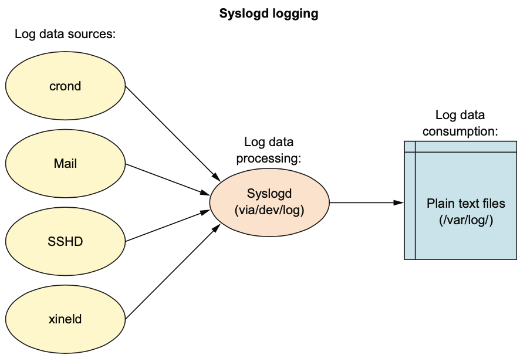
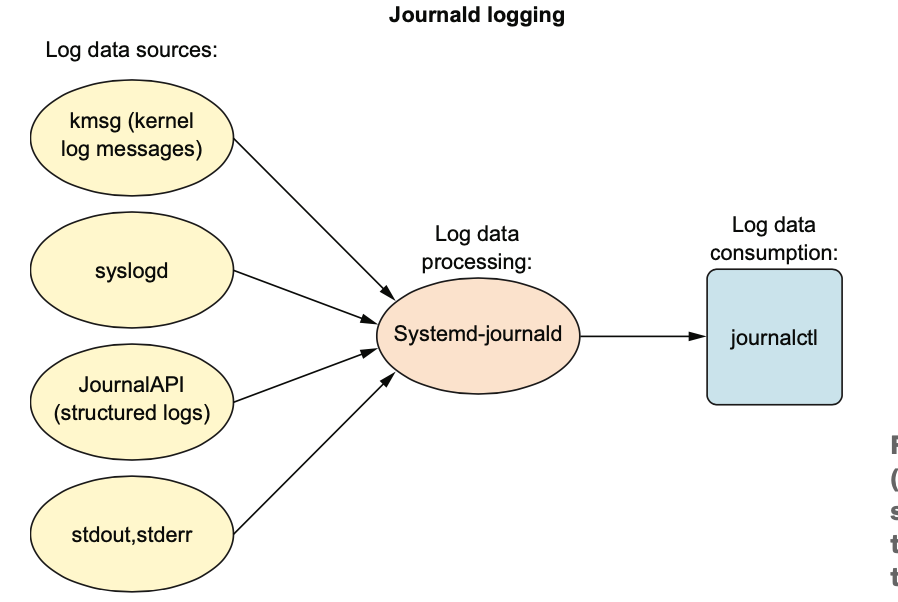

<h2>Eleventh chapter: logging</h2>

- Initially `syslogd` was the daemon that deals with logs
	- it processes logs from data sources in `/dev/log` and
		redirect them to `/var/log`

- 

- Now it's ALSO handled by `journald` with command `journalctl`
	- `journald` stores data in binary files, not in plain text
		like `syslogd`

- 