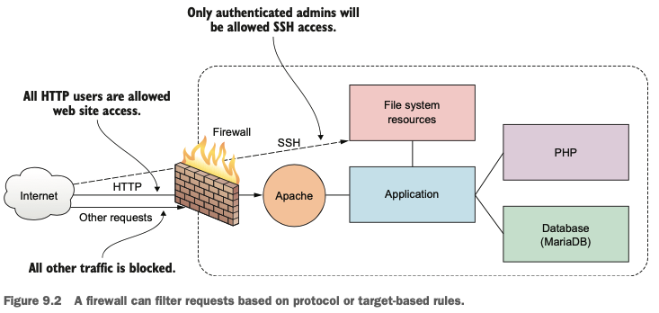
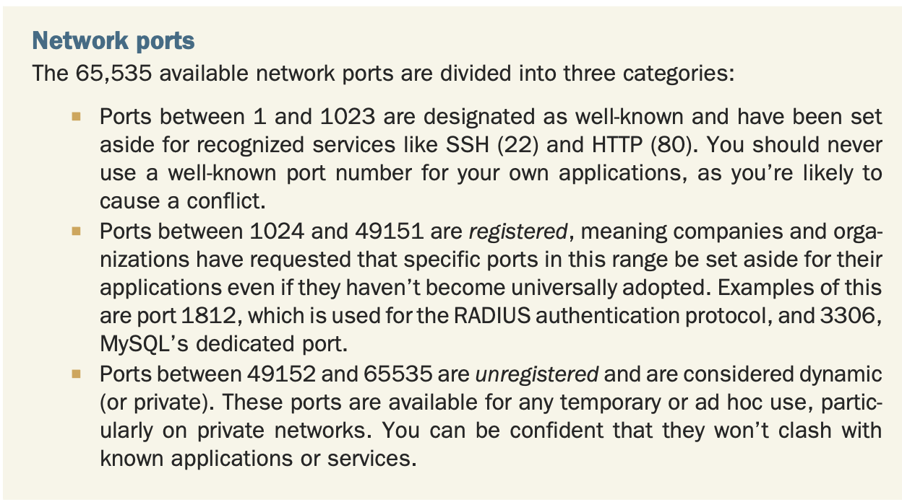
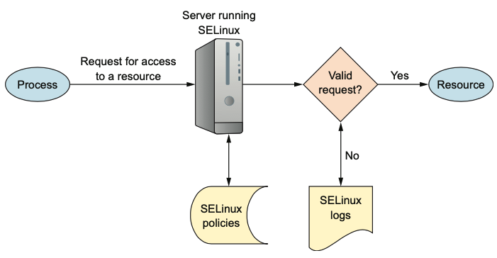

<h2>Ninth chapter: security</h2>

1. `Firewall` is a set of rules
	* content of data (origin/target, protocol) are tested against firewall rules

- 

2. linux machine is configured to apply firewall rules through `iptables`
	* CentOS's firewalld
	* Ubunutu's UncomplicatedFirewall (ufw)

3. Comamnds:
	- Install `firewalld` on Debian-based: `sudo apt install firewalld`
	- Check status: `sudo firewall-cmd --state`

4. HTTP over TLS: HTTPS
5. When data is transfered over network, it's separated into packets.
	Packet has metainfo
	* When **TCP** (Transmission Control Protocol) is used to transfer data: packets are checked for errors
	* When **UDP** (User Datagram Protocol) is used: faster, but no checks for errors

6. By default `firewalld` has only ssh turn on, whilst `http` & `https` are turned off:
	- `sudo firewall-cmd --permanent --add-port=80/tcp`
	- `sudo firewall-cmd --permanent --add-port=443/tcp`
	- `sudo firewall-cmd --reload`

	- eaiser: `sudo firewall-cmd --permanent --add-service=http`
	- current settings of firewall: `sudo firewall-cmd --list-services`

7. We shouldn't allow anyone to access our server over ssh:
	* turn off all ssh at first: `sudo firewall-cmd --permanent --remove-service=ssh`
		* `remove port` if applying on port
	* reload: `sudo firewall-cmd --reload`
	* add IP of current machine: `sudo firewall-cmd --add-rich-rule='rule family="ipv4" source address="10.8.61.90" port protocol="tcp" port="22" accept'`

8. `ufw` has **even ssh** turned off
	* `sudo ufw enable`; `sudo ufw disable`
	* `sudo ufw allow ssh`
	* `sudo ufw deny ssh` to deny the ssh
	* `sufo ufw allow 80`
	* `sudo ufw allow 443`
	* `ufw status`
	* `ufw delete 2` will delete second from the start (if looking at `status`)
		* use another if needed. Here we're to remove `ssh`
	* `sudo ufw allow from <Some IP> to any port <22>`

9. for security reasons it's better to change default ssh port from `22` to some other
	* `/etc/ssh/sshd_conf` - change your default ssh port
	* `systemctl restart ssh`
	* `ssh -p<port_number> name@remote_IP`
	* **Also** specify the protocol: `ufw allow port_num/tcp`
		* `ufw allow 52900:53000/tcp`

- 

10. read p. 188 about certbot

11. You can disable root logging in `/etc/ssh/sshd_conf` write PermitRootLogin no
12. `DAC` - discretionary access control system is the one where users have full access (recall `chmod`) over their resources
	* making `chmod 777` is a bad practice. What's better? -> install `SELinux`.
		It activates `MAC` (mandatory access control) -> you can't install inherently dangerous configs
	* principle of least privilege
	* Look on the net how to install && activate

- 

13. Commands related to groups:
	* `groupadd app-data-group`
	* `chown user:app-data-group file.txt` - changes group of the file to the new `app-data-group`
	* `usermod -aG app-data-group otheruser`

14. Auditing system resources:
	- `netstat -npl` - for ports
	- `systemctl list-unit-files --type=services --state=enabled` - for running services
	- `dpkg --list` is to list all services; `apt-get remove packageName` 
