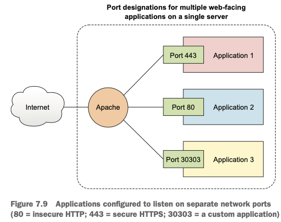

<h2>Seveth chapter: web servers</h2>

- static vs dynamic websites: former provide only plain HTML files and delegate
	all the work to the client browser, whilst latter has pages generated with the
	help of **server-side** operations

1. You can run `sudo apt install lamp-server^` to create a bundle with all the lamp-stack
	- but what if you want to customize i.e. version or smth like that? -> manual procedure

	1. install Apache
	2. add pages to thee web document root
	3. install an SQL engine
	4. install the PHP server-side scripting language
	5. install and configure MediaWiki

2. `web server` - guides you to the right dirs/files on the server host
	- `sudo apt install apache2` for Ubuntu
	- `sudo yum install httpd` for CentOS
		- `systemctl start httpd`
		- `systemctl enable httpd`

3. `CentOS` comes with all ports security whilst `Ubuntu` - without
	- p. 148 of the book for more info

4. Location of document root:
	- Ubuntu: `/etc/apache2/sites-available/` `httpd.conf` file
	- CentOS: `/etc/httpd/conf/` `000-default.conf` file
		- Apache will direct all incoming browser requests to `/var/www/html` by default

5. Data located in an individual row of db is known as **record**. Each **record** is identified
	by a **key** (aka ID)

6. Process with MariaDB:
	- `sudo apt update`
	- `sudo apt install mariadb-server`
	- `sudo systemctl status mysql`
	- **Important:** `sudo mysql_secure_installation` should be run if you weren't prompted to
		put password during isntallation

7. Ideally, you should never access db under a root user and create special user for db
	who has rights for dealing only with this db
		- `mysql -u root -p`
		- `CREATE DATABASE some_db;`
		- `use some_db;`
		- 
		```
			CREATE TABLE Contracts (
				ID int,
				LastName varchar(255),
				FirstName varchar(255),
				Address varchar(255),
				City varchar(255)
			);
		```
		- 
		```
		INSERT INTO Contracts (
			ID, LastName, FirstName, Address, City
			)
			VALUES ('001', 'Torvalds', 'Linus', '123 Any St', 'NewTown');
		```

	- to solve issue with root user:
		- `CREATE USER 'mw-admin'@'localhost' IDENTIFIED BY 'mypassword';`
		- `GRANT ALL PRIVILEGES ON wikidb.* TO 'mw-admin'@'localhost'
   IDENTIFIED BY 'mypassword';`
   		- `FLUSH PRIVILEGES;`

8. Final ingredient is PHP:
	- install php:
		- `sudo apt install php`
		- `sudo apt install libapache2-mod-php`
		- `sudo systemctl restart apache2` - whenever changes are done -> restart the server
	- add `.php` file

9. If you want to have some app inside one server: create folders where each of it will serve
	as a separate app

10. **Port** - way to identify a particular server resource to network users
	- i.e. server hosts 2 separate apps. Visitors can reach via IP address || DNS
		`=>` to visit particular app you need to use a **port**
	- how to control network traffic: throigh **firewall rules**

-  
