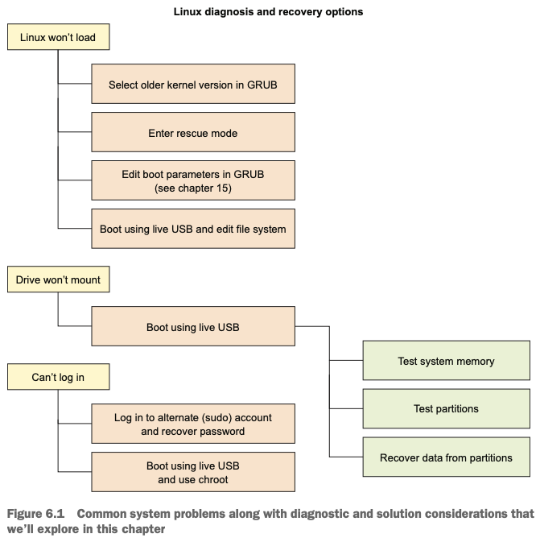
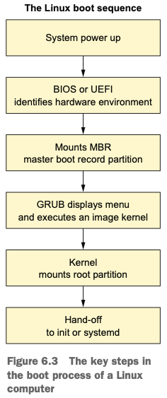

<h2>Sixth chapter: emergency tools</h2>

- 

1. **Grub**
	- GNU Grand Unified Bootloader
		- bootloader: code an OS uses to bring itself to life when it's powered on

- 

2. For Ubuntu press `esc` when system just loads to enter GRUB

3. `.ISO` of the OS can be loaded on the USB/CD and used to boot a live session of the OS
	- allows to load fully functioning Linux sessions without having to install anything to
		a hard drive
	- pugging **live-boot** USB drive can help you if, for ex, "Computer boots, but hard drive doesn't/you're not sure"
	- Which tools to use? So, at first you need a live ubuntu session
		- boot-repair disk: if you want to rescue an ubuntu session
		- GParted live: to deal with partitions
		- SystemRescueCD
	- <i>Startup Disk Creator</i> is to create an image from ISO to write to USB

4. read p. 118 on how to create an image
	- ps: use `isohybrid` to add MBR to a live-boot image

5. `mount`: assign partition to a location within a file system where it can be accessed
	- if partition isn't accessible, then we need to mountt it.
		- create empty dir within existing unused location
		- `mount /dev/sdc1 /run/temp-directory`
		- then you can copy healthy files from `temp-directory`

6. If previous step didn't help: `DDRescue`
	- copies files between file systems
	- 1. specify broken partition 2. specify partition where to save 3. specify where to put a log
		`ddrescue -d /dev/sdc1 /run/usb-mount/sdc1-backup.img /run/usb-mount/sdc1-backup.logfile`
		`dd if=backup.img of=/dev/sdd` 

7. Dealing with forgotten passwords:
	- `sudo passwd desired_user`: if you're an admin
	- if there is one admin and he was the one who forgot the password:
		- create dir in unused: `sudo mkdir /run/mountdir/`
		- mount your root (can be found by `lsblk`): `sudo mount /dev/sda_ /run/mountdir/`
		- `sudo chroot /run/mountdir/`
		- apply step with passwd from above
