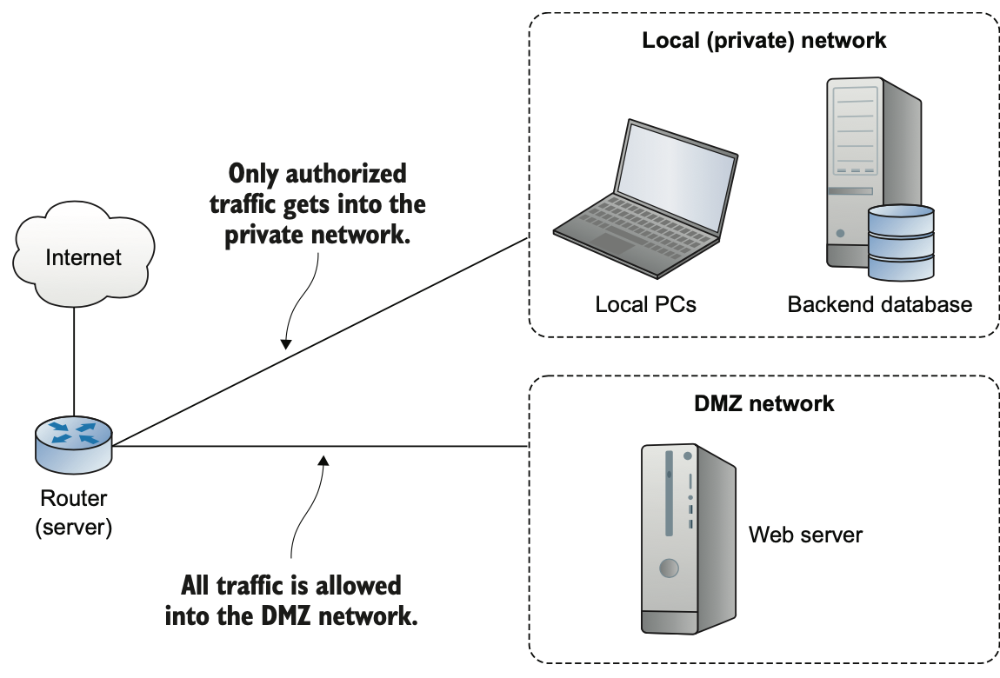

<h2>Tenth chapter: VPN or DMZ</h2>

- a) file encryption to protect data at resource b) TLS/SSL - to protect data in transit
	between client && server c) SSH/SCP - protect data transferred through remote connections

* What is VPN? 
	* secures data between remote client && server => creates secure channel
	* makes all remote networks as though they're locally

- use `zcat` to load content somewhere if file is compressed

* DMZ - demilitarized network
	* Local part is heavily protected
	* DMZ network is less stringent

- 

- Alternatives to DMZ: jump-servers

* **netfilter** is used to control network at the kernel level => ufw && firewalld are user-friendly coverage
* iptables -  Iptables is an interface that uses Netfilter to classify and act on packets
